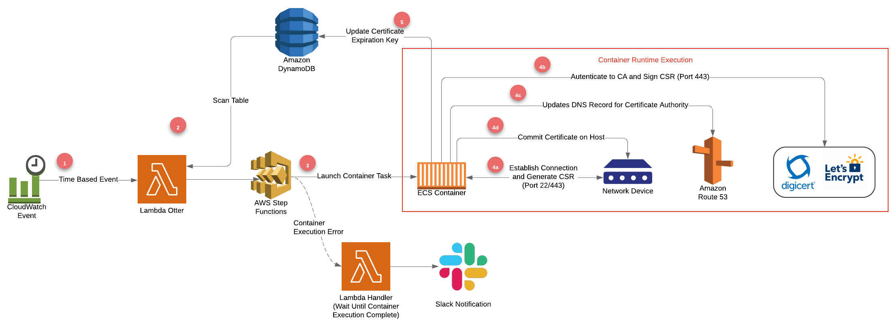
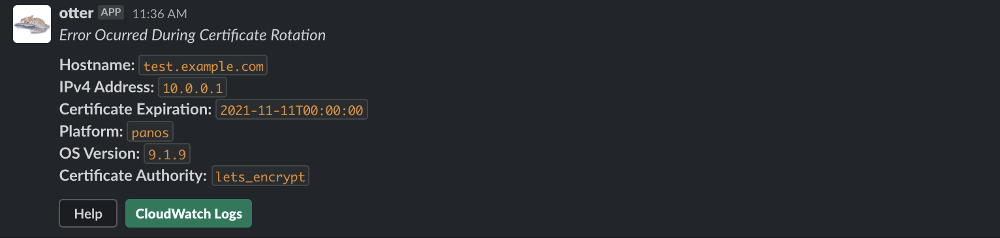
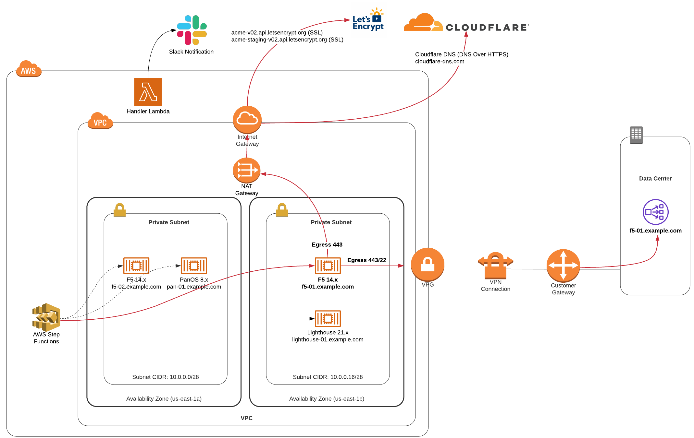
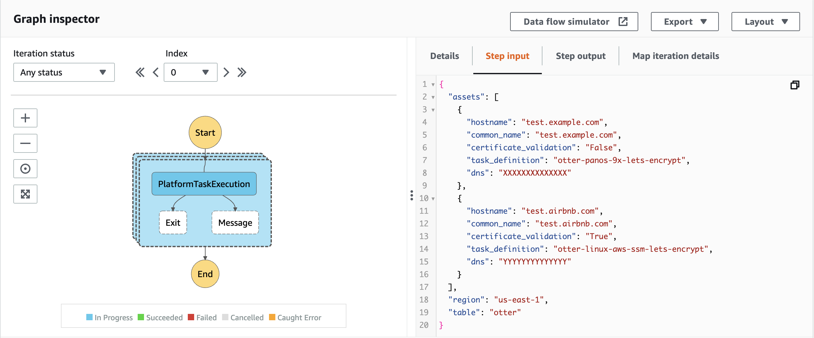
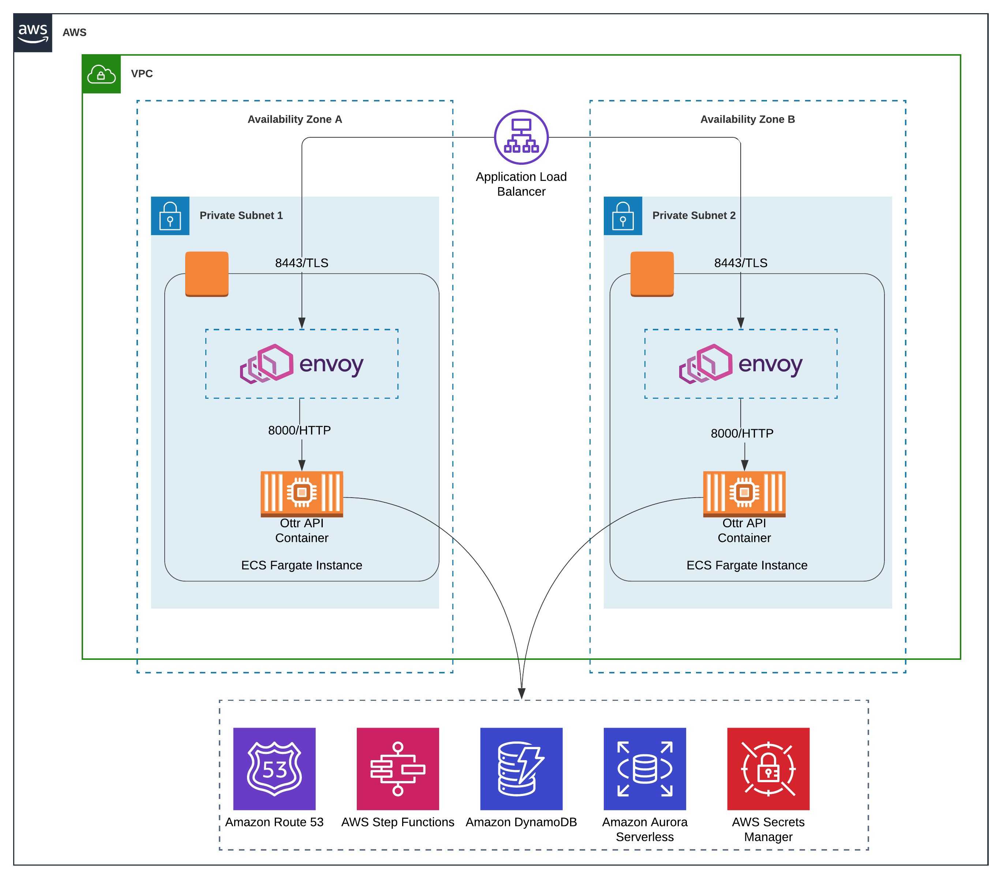
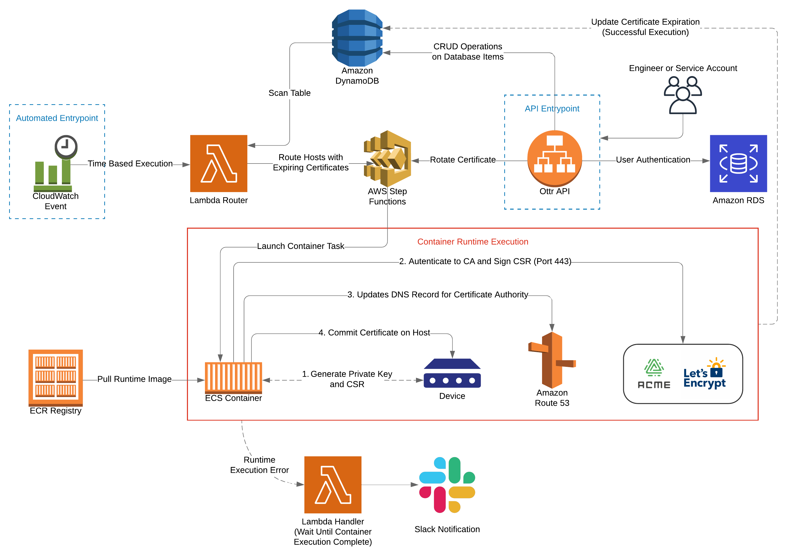

## Overview

Ottr aims to solve certificate rotations for any device that is not capable of
being managed by an agent and has the ability to configure their X.509
certificate from a remote session (via API, SSH, SSM Agent). Ottr attempts to build an
asset inventory of devices across your infrastructure and provides the framework
to automate the end-to-end certificate rotation lifecycle for these hosts.

While the current implementation uses Let's Encrypt as the Certificate Authority
(CA), Ottr can be extended to any CA that supports the ACME protocol.

**Ottr Core Platform:** [`infra/otter.tf`](../infra/otter.tf)



1. CloudWatch event executed to trigger Lambda function.

2. Otter Lambda function scans DynamoDB which contains device data in the
   following structure:

   ```py
   {
     "system_name": "test.example.com",
     "common_name": "test.example.com",
     "certificate_authority": "lets_encrypt",
     "certificate_expiration": "2021-10-31T01:49:35",
     "data_center": "DC1",
     "device_model": "PA-XXXX",
     "host_platform": "panos",
     "ip_address": "10.0.0.1",
     "origin": "API",
     "os_version": "9.1.0",
     "subject_alternative_name": [
       "test01.example.com",
       "test02.example.com"
     ]
   }
   ```

   - Once a device is queried from the database, the following information is checked:

     - Is the certificate_expiration field is either `None` (default value) or
       if the datetime is within 30 days of the expiration date?

     - Is there is a valid ECS task definition to perform the certificate
       rotation? A lookup based on the `host_platform`, `os_version`,
       `certificate_authority`, and `device_model` (Optional) for the device is
       checked against the [`routing config`](../otter/router/src/config/route.json).

   - If these conditions are true, the device data is stored until the
     entire database has been scanned. Once all assets that match the conditions
     are aggregated we create a payload in the following structure to send a
     batch request to AWS Step Functions using a Map state. For any devices that
     do not have a corresponding ECS task definition from the routing config
     file an error is logged within CloudWatch Logs under `/aws/lambda/otter`.

     ```py
     {
       "assets": [
         {
           "hostname": "test.example.com", # PanOS 9.x Device
           "common_name": "test.example.com", # Certificate Common Name (CN)
           "certificate_validation": "False", # Do Not Perform Certificate Validation for HTTP Requests (i.e. Self-Signed or Invalid Certificate on Host)
           "task_definition": "otter-panos-9x-lets-encrypt",
           "dns": "XXXXXXXXXXXXXX" # Route53 Hosted Zone ID for example.com
         },
         {
           "hostname": "test.airbnb.com", # Linux Distribution
           "common_name": "test.airbnb.com",
           "certificate_validation": "True", # Perform Certificate Validation (Current Valid Certificate on Host)
           "task_definition": "otter-linux-aws-ssm-lets-encrypt",
           "dns": "YYYYYYYYYYYYYY" # Route53 Hosted Zone ID for airbnb.com
         }
       ],
       "region": "us-east-1", # AWS Region Ottr is Built
       "table": "otter" # DynamoDB Table Name
     }
     ```

3. The `otter-state` Step Function will launch an ECS task which will build and
   run the platform specific container (i.e. PanOS 9.x) depending on the device
   data passed into the Step Function.

   - In the event that the container executes and exists with a non-zero
     status code the Step Function will route to the Lambda Handler which
     is a notification system that leverages Slack that sends messages to a
     designated channel and provides a link to the error logs for investigation:

   

4. When the Step Function executes an ECS task, a Fargate container is spun up
   after pulling the container image down from Elastic Container Registry (ECR).
   While the runtime logic varies depending on the platform of the host, the general flow is documented below:

   a. Container connects to host and checks the following conditions:

   - Host is reachable.
   - Common Name (CN) and Subject Alternative Names (SANs) have CNAME records
     to your organization's subdelegate zone. More information provided
     within [`dns/README.md`](../dns/README.md).
   - If any of the conditions are not met, the container will exit with a
     non-zero status code and a notification will be generated through the Lambda
     Handler.

   b. Container reaches out to device to generate a Public/Private Key Pair and
   Certificate Signing Request (CSR) on the device and pulls the CSR back onto
   the container.

   c. The CSR is sent to the Certificate Authority (i.e. Let's Encrypt) to sign.
   [`acme.sh`](https://acme.sh) is used as the ACME Client to perform the certificate signing
   process.

   d. Since the Certificate Authority (CA) needs to validate domain ownership
   for the Common Name (CN) and Subject Alternative Names (SANs) within your
   Certificate Signing Request (CSR), `DNS-01 challenge` is used to write a DNS
   TXT record within the subdelegate zone.

   e. After the domain is validated a certificate is generated by the
   Certificate Authority which the ACME Client subsequently pulls down and
   writes to the container filesystem. A separate request is made from the
   runtime logic to push the certificate onto the host and commit changes.

5. After a certificate is committed to the device, validation checks are performed to ensure that the
   certificate issuer is from the expected CA as well as contain an expiration date that
   is in line with a newly provisioned certificate. For example, depending on the
   `certificate_authority` field within the database the expiration time varies
   as `lets_encrypt` certificates are only valid for 90 days while `digicert`
   certificates are valid for 13 months. After the validation, the certificate
   expiration date is updated within DynamoDB in the `certificate_expiration`
   index.

**Network Routing:**

From a network standpoint Ottr is deployed within two dedicated private subnets in
different availability zones (AZs). It is recommended to use start with smaller
subnets (e.g., /28) that are dedicated for this service as the routes that will be reachable into
the on-prem environment will be wide ranges over ports 443 and 22. Prerequisites
are listed below:

1. 22 (SSH), and/or 443 (SSL, AWS SSM) connections between the private subnets and the
   devices set for rotations on-prem or within AWS (Internal):
   - When containers are executed, the requests that are made to the device are
     either HTTP Requests or from an SSH Client. The majority of cases only
     require 443, but in certain use cases 22 is also required.
2. 443 (SSL) for routes to the following Let's Encrypt
   Endpoints (Internet):
   - [Production] `https://acme-v02.api.letsencrypt.org`
   - [Staging] `https://acme-staging-v02.api.letsencrypt.org`
3. 443 (DNS over HTTPS) for Cloudflare DNS:
   - [Production] `cloudflare-dns.com`
4. If your organization is performing L7 packet filtering at your edge firewalls
   you will also need to allow connections to `*.amazonaws.com`.



When the Step Function receives the step input, it will assess each element
within `assets` and executes ECS tasks in parallel with a default concurrency of 50. The only limitation to this is if there are more hosts that require
certificate rotations than the number of Elastic Network Interfaces (ENI)
available in the subnets that Ottr runs in since each container binds to an ENI
during runtime. In the case this happens, the Step Function will set the other
tasks back in the queue and execute when an ENI becomes available.



**Ottr API:** [`infra/api.tf`](../infra/api.tf)

Ottr API is a Swagger API built on top of Flask-RESTX. It is fronted by an AWS
Application Load Balancer (ALB) and handles compute using a Fargate backed ECS
Cluster that uses an Envoy sidecar to ensure end-to-end TLS before forwarding
the request to the application.

The API provides the ability to update and search the database in a programmatic manner
as well as execute rotations in the case of one-off cases. A number of input
validation checks are also performed to ensure that the data is in a valid
format before being written into the database.

- Deploying the API will be done through [`infra/api.tf`](../infra/api.tf). We
  recommend you choose two private subnets to deploy the instances in but if
  that is not possible it is also configurable to run within public subnets.
- The `ingress_ip_ranges` field will determine what IP Ranges will allow you to
  access the API (443) as well as provide SSH (22) connectivity to the EC2
  backed hosts for ECS. If you require a deployment in a public subnet please
  ensure that it is appropriately locked down to only addresses your organization can reach.

| Endpoint                                                                | Permissions | Description                                                                                     |
| ----------------------------------------------------------------------- | ----------- | ----------------------------------------------------------------------------------------------- |
| /admin/v1/users [GET]                                                   | ADMIN       | List Users                                                                                      |
| /admin/v1/users [POST]                                                  | ADMIN       | Create Users                                                                                    |
| /admin/v1/users/{username} [DELETE]                                     | ADMIN       | Delete Users                                                                                    |
| /admin/v1/management/certificate-validation/unset/{system_name} [PATCH] | ADMIN       | Unset Certificate Validation for HTTP Requests if Device has Self-Signed or Invalid Certificate |
| /admin/v1/management/certificate-validation/set/{system_name} [PATCH]   | ADMIN       | Set Certificate Validation if /unset was Used Unintentionally                                   |
| /api/v1/assets [POST]                                                   | PRIVILEGED  | Add Assets                                                                                      |
| /api/v1/assets [PUT]                                                    | PRIVILEGED  | Update Assets                                                                                   |
| /api/v1/assets/delete/{system_name} [DELETE]                            | PRIVILEGED  | Delete Assets                                                                                   |
| /api/v1/certificate/rotate/{system_name} [POST]                         | PRIVILEGED  | Manual Certificate Rotation                                                                     |
| /api/v1/search [GET]                                                    | DEVELOPER   | Query Database for Assets                                                                       |
| /user/v1/authenticate [POST]                                            | DEVELOPER   | Generate Bearer Token                                                                           |
| /user/v1/authenticate [PUT]                                             | DEVELOPER   | Update Password                                                                                 |



**Ottr Core Platform + Ottr API:**

_The architecture below demonstrates the overall flow with how the API
integrates with Ottr Core Platform._


