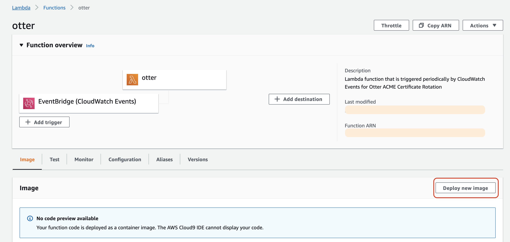

# Contributing to Ottr

Ottr provides a framework to streamline the end-to-end rotation lifecycle for X.509
certificates on any agentless device. The premise of the architecture was built
around the principle that engineering teams would traditionally build custom scripts to
automate as much of their infrastructure as possible, including rotating X.509 certificates.
Ottr extends this principle by creating a modular design where these existing scripts
can be containerized and dropped into the framework to begin automating
certificate rotations no matter what stack your organization is running.

The simplest way to contribute is to provide two scripts for a platform that
currently is not supported or a newer OS version of an existing platform that
has a flow that is different from older versions.

1. Generate Public/Private Key Pair and Certificate Signing Request (CSR)
2. Uploading a Signed Certificate Up to Device

By providing those two scripts that is the majority of the logic required for us
to integrate a new platform. However, if you are looking to do a full
integration, you will need to copy a baseline template from
[`platforms/template`](../platforms/template) and continue following the steps below.

## Example Scenerio

_Our organization wants to integrate certificate rotations for the
following devices._

- Platform: Juniper JunOS
- OS Version: 18.2
- Model: SRX5600
- Certificate Authority: Let's Encrypt

## Prerequisite Setup

1. Since the current platform (Juniper JunOS) is not currently supported we need to
   change the [`routing config`](../otter/router/src/config/route.json) and
   [`API routing config`](../api/backend/app/config/route.json) to add a valid entry.

   - Within the routing config files, the `certificate_authority` field is in
     the key value structure `[certificate_authority]`:
     `otter-[platform]-[version]-[certificate_authority]`. That value represents
     the ECS task definition that determines which container to run based on the
     host metadata (i.e. Juniper JunOS 18.2 SRX5600 using Let's Encrypt). You
     can name this in any format you want but we recommend you follow the
     standard.

   ```json
    "platform": {
    "junos": {
      "os": {
        "18.2": {
          "certificate_authority": {
            "lets_encrypt": "otter-junos-18x-lets-encrypt"
          },
          "model": [
            "SRX5600"
          ]
        },
      }
    }
   ```

2. Build and Update API and Lambda

   ```bash
   cd $HOME/Desktop/ottr-venv/ottr
   # PREFIX: Variable from infra/otter.tf
   make build-api AWS_REGION=[VALUE] AWS_ACCOUNT_ID=[VALUE] TABLE=otter PREFIX=[VALUE]
   make build-otter-router AWS_REGION=[VALUE] AWS_ACCOUNT_ID=[VALUE]
   ```

   - For Lambda functions running containers, even after a container image is
     updated to ECR, the Lambda function still required you deploy the image
     again.
     - Login to AWS
     - Search `otter` within Lambda
     - Deploy New Image &rarr; Save

   

3. Add device to database through API using the `PUT /api/v1/assets` endpoint.

   ```py
   import requests
   import json

   username = ''
   password = ''

   url = 'https://[API_ENDPOINT]'
   data = {
      "username": username,
      "password": password
   }
   # Authenticate to API
   response = requests.post(url=url + '/user/v1/authenticate', json=data)
   output = json.loads((response.content).decode('utf-8'))
   token = output.get('token')

   # Add Device to Database
   data = {
      "system_name": "subdomain.example.com",
      "common_name": "subdomain.example.com",
      "certificate_authority": "lets_encrypt",
      "data_center": "DC1",
      "device_model": "SRX5600",
      "host_platform": "junos",
      "ip_address": "10.0.0.1",
      "os_version": "18.2",
      "subject_alternative_name": [
         "test.example.com"
      ]
   }
   response = requests.put(url=url + '/api/v1/assets', headers={"Authorization": token}, json=data)
   print(response.content)
   ```

4. Now that there is a valid route to execute a container, the module in
   [`infra/container.tf`](../infra/container.tf) will build the ECS task
   definition and ECR registry. The ECS task definition that was referenced
   within the routing config will be used as the `family` field within the
   module. The `repo_name` field should be what you name the directory when you
   create it under [ottr/platforms](../platforms).

   ```
   module "otter_junos" {
      source             = "./modules/container"
      repo_name          = "otter-junos-18.x"
      family             = "otter-junos-18x-lets-encrypt"
      task_role_arn      = aws_iam_role.otter_ecs_fargate.arn
      execution_role_arn = aws_iam_role.otter_ecs_fargate.arn
   }
   ```

5. Use the Secrets Module in [`infra/secrets.tf`](../infra/secrets.tf), that
   will be used to generate a item within AWS Secrets Manager. Those credentials
   will be used for authentication against your any device that matches the platform.

   ```
   module "junos" {
      source         = "./modules/secrets"
      name           = "prod/otter/junos"
      region         = var.region
      aws_account_id = data.aws_caller_identity.otter.account_id
   }
   ```

6. Build Infrastructure for ECS and Secrets Manager

   ```bash
   cd $HOME/Desktop/ottr-venv/ottr/infra
   terraform init
   terraform apply
   ```

   **Secrets Manager:**

   - Login to AWS
   - Search `prod/otter/junos`
   - Retrieve Secret Value &rarr; Edit
     - Add `username` and `password` as within the key elements and include the
       corresponding values used for authentication.
       

   **ECS:**

   - When the container module is built an ECS task definition is created that
     links to an ECR image i.e.
     `[ACCOUNT_ID].dkr.ecr.[REGION].amazonaws.com/otter-junos-18.x-lets-encrypt:latest`.
     After writing the container runtime logic, which is described in the
     following section, we can build and push the image to the registry that was
     created by this Terraform container module.

7. Include DNS domain alias by adding an entry into [`dns/platform.tf`](../dns/platform.tf) for each
   Common Name (CN) as well as all Subject Alternative Names (SANs) per host.
   When we created the element in the database we set the common_name
   to `subdomain.example.com` and the subject_alternative_name was
   `test.example.com`. Since we are using DNS Subdelegation to perform
   validation the module below will perform the CNAME mapping.

   ```bash
      module "dns_junos_example" {
         source                    = "./modules/dns"
         certificate_common_name   = "subdomain.example.com"
         subject_alternative_names = ["test.example.com"]
         alias_domain_name         = "example-acme.com"
      }
   ```

   ```sh
   _acme-challenge.subdomain.example.com
   => _acme-challenge.subdomain.example-acme.com

   _acme-challenge.test.example.com
   => _acme-challenge.subdomain.example-acme.com
   ```

## Developing Platform Container

After building and configuring the infrastructure, now it's time to write the
runtime logic to perform rotations on the designated platform. The
[`template`](../platforms/template) directory contains the skeleton for the
runtime logic. The template will need to be copied to a new directory such as `platforms/junos-18.x`.

Before building and pushing any images to ECR for testing, we want to ensure
that there are no issues running locally. To configure your local environment
you will need to open
[`environment.sh`](../platforms/template/config/environment.sh) and update the
following fields:

1. `AWS_REGION`: Region you are build the Ottr infrastructure in.
2. `DYNAMODB_TABLE`: Name of the DynamoDB Table for Ottr's Asset Inventory.
3. `HOSTED_ZONE_ID`: Route53 Hosted Zone ID, depending on the Fully Qualified
   Domain Name (FQDN) for your device this value will differ. For example, if
   you are attempting a certificate rotation on subdomain.example.com you will
   need to look within Route53 for the Hosted Zone ID for example.com.
4. `HOSTNAME`: Fully Qualified Domain Name (FQDN) for the host (i.e.
   subdomain.example.com) that Ottr you will connect to.
5. `COMMON_NAME`: Common Name (CN) value for the certificate.
6. `ACME_DNS`: Route53 Subdelegate Zone (`acme_subdelegate_zone` field in
   [`infra/otter.tf`](../infra/otter.tf))
7. `PREFIX`: Secrets Manager prefix defined from
   [infra/otter.tf](../infra/otter.tf).
8. `VALIDATE_CERTIFICATE`: In case that the device you are registering does not
   have a valid certificate (i.e. self-signed certificate) set this value to
   False. After the initial run, this will be set to true in order to perform
   certificate validation before any connection is made to the host.
9. `email`: Include the organizational email you want to register your Let's Encrypt profile with.

After adding these environmental variables execute `. ./environment.sh` (don't
forget the dot preceding the ./) since you will want to execute as a parent
process.

Within the [`template/src/app.py`](../platforms/template/src/app.py) file there
are instructions to explain the flow required to perform a certificate rotation.
As mentioned previously `acme.sh` is used as the ACME Client to sign a CSR from
our Certificate Authority. Below there are explanations on how to use the
client.

```py
# Instantiate Let's Encrypt Client for Certificate Signing / Performs Validations
le_client = LetsEncrypt(
    hostname=hostname, subdelegate=dns, subject_alternative_names=subject_alternative_names,
    region=region_name)

# acme_local is used when executing the scripts locally during the first stage of testing. The Let's Encrypt Staging server is used and will provide an invalid staging certificate. This will be executed locally and not on the container.
le_client.acme_local(csr=path)

# The Let's Encrypt Staging server will still be used for acme_development. However, this implementation will be used when acme_local has succeeded and you are ready to build your container and push it to Elastic Container Registry (ECR).
le_client.acme_development(csr=path)

# When acme_development passes you are ready to push out the production image, all that needs to change within the file is to change acme_development to acme_production. This will use the production Let's Encrypt ACME endpoint and generate a valid certificate.
le_client.acme_production(csr=path)
```

When you're ready to start running tests locally, run the following:

```sh
cd ottr-venv/ottr/platforms/junos-18.x/src
python3 app.py
```

## Building Container Image

Before pushing any images to ECR you need to check a few conditions:

1. `acme_local` is not being used and `acme_development or acme_production` is
   being run.
2. `requirements.txt` within the platform directory include all of the
   dependencies.
3. Remove `config` folder and all `__init__.py` files from the platform
   directory.

When you are ready to build your container image and push a development or
production version up to ECR the process is the same. Within the root directory
there is a [`Makefile`](../Makefile) that is used as a local mechanism to build
and push images to our container registry.

```
build-junos-18.x:
	$(info *** build and upload containers to AWS ECR)
	aws ecr get-login-password --region $(AWS_REGION) | docker login --username AWS --password-stdin $(AWS_ACCOUNT_ID).dkr.ecr.$(AWS_REGION).amazonaws.com
	docker build -t $(CONTAINERS_PREFIX)-junos-18.x-lets-encrypt:latest $(CONTAINERS_DIR)/junos-18.x/.
	docker tag $(CONTAINERS_PREFIX)-junos-18.x-lets-encrypt:latest $(AWS_ACCOUNT_ID).dkr.ecr.$(AWS_REGION).amazonaws.com/junos-18.x-lets-encrypt:latest ; \
	docker push $(AWS_ACCOUNT_ID).dkr.ecr.$(AWS_REGION).amazonaws.com/junos-18.x-lets-encrypt:latest ; \
```

```sh
cd $HOME/Desktop/ottr-venv/ottr
make build-junos-18.x
```

After the image is pushed up, manuel executions can be run for testing. This can
be done in two ways:

1. `POST ​/api​/v1​/certificate​/rotate​/{system_name}` API Endpoint
2. Execute [`execute.py`](../otter/manual/execute.py) after configuring
   environmental variables:

   - `REGION`: Region you are build the Ottr infrastructure in.
   - `AWS_ACCOUNT`: AWS Account ID
   - `DYNAMODB_TABLE`: Name of the DynamoDB Table for Ottr's Asset Inventory.
   - `HOSTED_ZONE_ID`: Route53 Hosted Zone ID, depending on the Fully Qualified
     Domain Name (FQDN) for your device this value will differ. For example, if
     you are attempting a certificate rotation on subdomain.example.com you will
     need to look within Route53 for the Hosted Zone ID for example.com.
   - `hostname`: FQDN of host that you will be making the connection to.
   - `common_name`: Certificate Common Name (CN) field that will be set for the certificate.
   - `task_definition`: ECS Task Definition, this is the same value that was
     generated in the `family` field within `infra/container.tf`
   - `dns`: Route53 Hosted Zone ID for Host Domain

   ```py
   cd ottr-venv/ottr/otter/manual
   python3 execute.py
   ```

This execution of either of these processes will kick off an AWS Step Function
that will fire off an ECS task. If an error is generated the Lambda Handler
should generate a Slack notification and provide you a link to the CloudWatch
Log entry. If there are any issues there, you can find the logs in the `/ecs/otter`
Log Group.

Once the production ready image is pushed to ECR, as long as the device metadata
within the database match the routing config in the API and Core Platform,
certificate expirations will be tracked natively and runs will be executed 30
days before the certificate expires.
