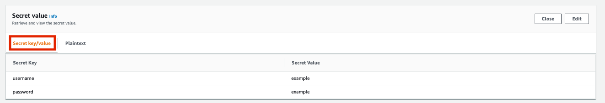
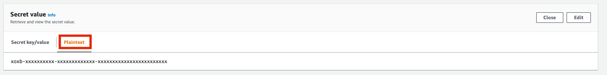

# Terraform Infrastructure

## Prerequisites

1. Set the default region for Terraform in [`infra/variables.tf`](variables.tf).
2. Within the [`routing config`](../otter/router/src/config/route.json) file and
   [`API routing config`](../api/backend/app/config/route.json) file there will be a field named
   `hosted_zones`. Add your organization's domain(s) as the key and the Route53
   Hosted Zone ID as the value.
3. In the [`handler config`](../otter/handler/src/conf.ini) add the Slack Channel and Redirect Link:
   - `channel`: Slack channel used to send error messages.
   - `redirect`: Redirect link to your team's on-call channel.
     - To get the redirect link login to app.slack.com on the web and open the
       channel you want to redirect messages to.
     - The URL for that page should be in the format:
       `app.slack.com/client/{VALUE_1}/{VALUE_2}`
     - `VALUE_1` is used for the `team` field and `VALUE_2` is used for the `id`
       field.

## Configuration

`infra/otter.tf`: Terraform Module for Ottr Core Platform

| Variable              | Optional | Type         | Description                                         | Default       | Example                                         |
| --------------------- | -------- | ------------ | --------------------------------------------------- | ------------- | ----------------------------------------------- |
| acme_subdelegate_zone | False    | string       | Route53 Zone to be Created for DNS Subdelegation    |               | "company-acme.com"                              |
| hosted_zone_ids       | False    | List[string] | Route53 Hosted Zone IDs within Organization         |               | ["arn:aws:route53:::hostedzone/XXXXXXXXXXXXXX"] |
| subnet_cidr_block     | False    | List[string] | IP CIDR Blocks for Subnets AZ1 and AZ2              |               | ["10.0.1.0/24", "10.0.2.0/24"]                  |
| subnet_az1            | False    | string       | Subnet ID for Primary Availability Zone             |               | "subnet-0123456a"                               |
| subnet_az2            | False    | string       | Subnet ID for Secondary Availability Zone           |               | "subnet-0123456b"                               |
| vpc_id                | False    | string       | VPC ID                                              |               | "vpc-12345678"                                  |
| country               | False    | string       | Certificate Signing Request: Country (C)            |               | "US"                                            |
| state                 | False    | string       | Certificate Signing Request: State (ST)             |               | "CA"                                            |
| locality              | False    | string       | Certificate Signing Request: Locality (L)           |               | "San Francisco"                                 |
| email                 | False    | string       | Certificate Signing Request: Email (EMAIL)          |               | "example@company.com"                           |
| organization          | False    | string       | Certificate Signing Request: Organization Name (O)  |               | "Company, Inc."                                 |
| organization_unit     | False    | string       | Certificate Signing Request: Organization Unit (OU) |               | "Security"                                      |
| prefix                | True     | string       | Secrets Manager Prefix Path                         | prod          | development                                     |
| region                | True     | string       | AWS Region                                          | "us-east-1"   | "us-west-1"                                     |
| cloudwatch_schedule   | True     | string       | CloudWatch Event Frequency to Execute Ottr          | "rate(1 day)" | "rate(12 hours)"                                |
| database              | True     | string       | RDS Database Name                                   | "otter"       | "otter-db"                                      |

`infra/api.tf`: Terraform Module for Ottr API (API Module)

| Variable             | Optional | Type         | Description                                        | Default     | Example                                         |
| -------------------- | -------- | ------------ | -------------------------------------------------- | ----------- | ----------------------------------------------- |
| ingress_ip_ranges    | False    | List[string] | IP CIDR Blocks for Ingress Traffic on API          |             | ["172.16.0.0/24", 172.16.1.0/24]                |
| subnet_cidr_block    | False    | List[string] | IP CIDR Blocks for Subnets AZ1 and AZ2             |             | ["10.0.1.0/24", "10.0.2.0/24"]                  |
| subnet_az1           | False    | string       | Subnet ID for Primary Availability Zone            |             | "subnet-0123456a"                               |
| subnet_az2           | False    | string       | Subnet ID for Secondary Availability Zone          |             | "subnet-0123456b"                               |
| vpc_id               | False    | string       | VPC ID                                             |             | "vpc-12345678"                                  |
| hosted_zone_ids      | False    | List[string] | Route53 Hosted Zone ID ARNs within Organization    |             | ["arn:aws:route53:::hostedzone/XXXXXXXXXXXXXX"] |
| api_zone_id          | False    | string       | Route53 Hosted Zone ID API will Reside             |             | "XXXXXXXXXXXXXX"                                |
| api_domain_name      | False    | string       | FQDN of API (Domain Must Match api_zone_id Domain) |             | "ottr.example.com"                              |
| internal_alb         | True     | boolean      | Internal Load Balancer in Private Subnets          | true        | true                                            |
| region               | True     | string       | AWS Region                                         | "us-east-1" | "us-west-1"                                     |
| instance_type        | True     | string       | EC2 Instance Type for ECS Cluster                  | "t2.small"  | "t2.medium"                                     |
| ec2_minimum_capacity | True     | string       | Minimum Number of Instances in ECS Cluster         | 1           | 2                                               |
| ec2_maximum_capacity | True     | string       | Maximum Number of Instances in ECS Cluster         | 2           | 3                                               |
| ec2_desired_capacity | True     | string       | Desired Number of Instances in ECS Cluster         | 2           | 2                                               |

_Note: If `internal_alb` is set to true you will need to create an DNS CNAME Record
for your internal DNS servers to point `api_domain_name` to the Application Load
Balancer DNS record. If internal_alb is set to false this is handled
automatically for you in Route53 since the API will be externally facing._

`infra/api.tf`: Terraform Module for Ottr API (ACM Module)

| Variable                  | Optional | Type         | Description                                       | Default | Example                                             |
| ------------------------- | -------- | ------------ | ------------------------------------------------- | ------- | --------------------------------------------------- |
| domain_name               | False    | string       | Address for Ottr API (Must Own Route53 Domain)    |         | "`ottr.example.com`"                                |
| zone_id                   | False    | string       | Route53 Hosted Zone ID for `domain_name` Variable |         | "Z2ZBSSGGIDRSTL" [Hosted Zone ID for `example.com`] |
| subject_alternative_names | True     | List[string] | Subject Alternative Names for Certificate         |         | ["`sub.example.com`", "`test.example.com`"]         |

## Build Ottr Infrastructure

```bash
# Download Terraform
brew tap hashicorp/tap
brew install hashicorp/tap/terraform

# Activate Virtual Environment
source ottr-venv/bin/activate
cd $HOME/Desktop/ottr-venv/ottr/infra

# Build Ottr and Ottr API Infrastructure
terraform init
terraform apply
```

## Configure Ottr

When Ottr executes an ECS task, that in turn starts up a container that has the
logic required to perform an end-to-end certificate rotation process. The
container that is launched depends on Platform, OS Version, Device Model, and
Certificate Authority. Once that container runs, it will first need to establish
a connection to the device since requests are made either through HTTP Requests
or an SSL Client.

- [`infra/secrets.tf`](../infra/secrets.tf) references the Terraform module that creates secrets within
  AWS Secrets Manager for each platform.
- Once the secrets are created, within AWS Secrets Manager search `[PREFIX]/otter/[PLATFORM_NAME]` and update
  the secrets value with a `username` and `password` field under `Secret key/value`. These credentials are used to authenticate against a specified platform (i.e.
  PanOS) during container runtime.



For error handling Ottr uses Slack as a notification mechanism for any certificate
rotation failures. You can modify this for your organization's use case within
the [`handler`](../otter/handler/src) function but if you prefer to use Slack you will need to create a
Slack App.

1. Create Slack App: `https://api.slack.com/apps`
2. Define OAuth & Permissions:
   - `chat:write`
   - `incoming-webhook`
3. Generate OAuth Token and to Copy into AWS Secrets Manager Under `Plaintext`:
   - `xoxb-xxx` (Bot User OAuth Token) &rarr; `[PREFIX]/otter/slack`



## Configure Ottr API

_After the infrastructure is built the API will be reachable from the DNS Name
from the Application Load Balancer. Since we have already created a certificate
using Certificate Manager we will need to point a DNS CNAME Record from the
Certificate Manager certificate Domain Name to the ALB DNS Name. Depending on
how your infrastructure is built this will be done either through Route53 or
your organization's internal DNS._

Now we move onto the configuring authentication for the API which RS256 to sign
the JSON Web Token:

1. Create Public/Private Key Pair and Upload Private Key to AWS Secrets Manager
   under `[PREFIX]/otter/private_key`.

   ```bash
   openssl genrsa -out ottr.pem 4096
   openssl rsa -in ottr.pem -pubout -out ottr_pub.pem
   ```

2. Copy the Public Key from `ottr_pub.pem` and write value in Secrets Manager at
   [PREFIX]/otter/public_key under the Plaintext type.

3. Copy the Private Key from `ottr.pem` and write value in Secrets Manager at
   [PREFIX]/otter/private_key under the Plaintext type.

4. Build the API container, push image to ECR, and restart the ECS Service for
   Ottr API.

   ```bash
   cd $HOME/Desktop/ottr-venv/ottr
   make build-api AWS_REGION=xxx AWS_ACCOUNT_ID=xxx TABLE=xxx PREFIX=xxx
   ```

   _Environmental variables are referenced in `otter.tf`._

   - `AWS_REGION` &rarr; `region` field in `otter.tf` (Default: `us-east-1`)
   - `TABLE` &rarr; `database` field in `otter.tf` (Default: `otter`)
   - `PREFIX` &rarr; `prefix` field in `otter.tf` (Default: `prod`)
   - `AWS_ACCOUNT_ID` &rarr; AWS Account ID

## Create Admin User in Database for API

1. Install Packages to Virtual Environment

   ```bash
   cd $HOME/Desktop/ottr-venv/ottr/api/setup
   pip3 install -r requirements.txt
   ```

2. Take the Private Key `ottr.pub` and add it to the PRIVATE_KEY variables in the
   [`setup`](../api/backend/setup/credentials.py) file.

   ```bash
   cd $HOME/Desktop/ottr-venv/ottr/api/setup
   python3 credentials.py
   ```

3. Copy `Bearer XYZ` Output and Cerate User in API Using the `POST /admin/v1/users` Endpoint by Using Bearer Token in Authorization Header

   - This will be an administrative user that will have the capability of
     generating other users within your organization. You can authenticate
     against the `POST /user/v1/authenticate` Endpoint.

     ```py
     # /admin/v1/users Authorization Header
     Bearer XYZ

     # /admin/v1/users Endpoint Payload
     {
        "username": "string",
        "password": "string",
        "role": "ADMIN"
     }
     ```

4. Delete `PRIVATE_KEY` from [`setup`](../api/setup/credentials.py)
   file.

_Continue at [`SETUP.md`](../docs/SETUP.md) to complete the remainder of setup._

## Build Platform Containers

_Built runtime containers and push to ECR registry._

```bash
cd $HOME/Desktop/ottr-venv/ottr/
make build-containers-release AWS_REGION=[VALUE] AWS_ACCOUNT_ID=[VALUE]
```
